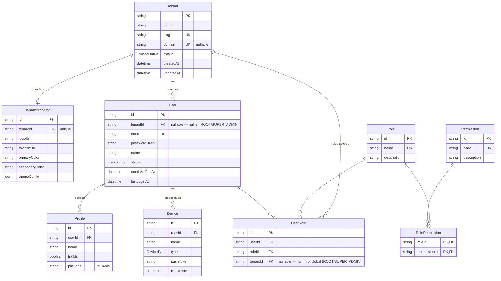
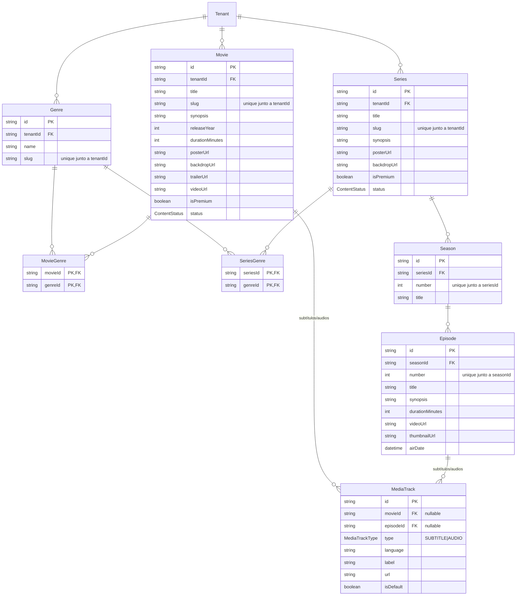
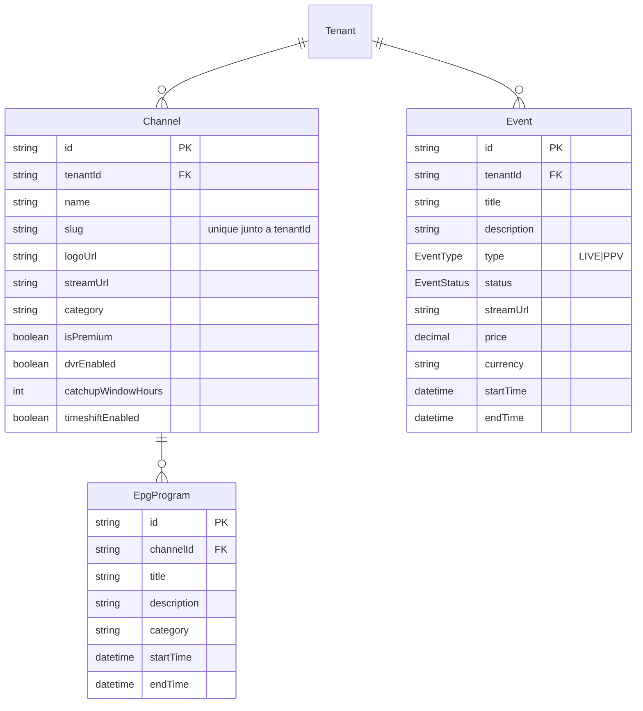
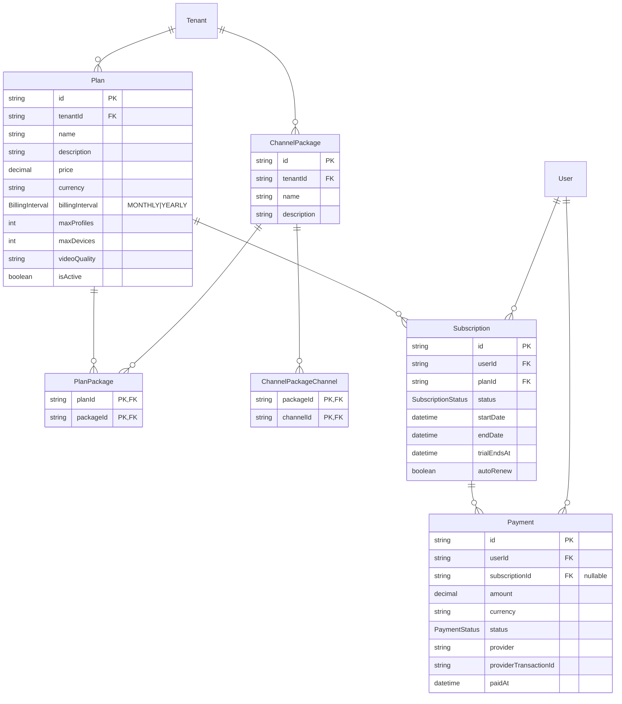

# WAMVIDEO — Base de datos

Motor: PostgreSQL 17, alojado en Supabase (proyecto `wamvideo`, org `wam_video`, región `us-west-2`). Gestionado con Prisma.

| Qué | Dónde |
|---|---|
| Schema | [`backend/bd/schema.prisma`](../backend/bd/schema.prisma) |
| Migraciones | `backend/bd/migrations/` (generadas por `prisma migrate dev`, la primera es `20260724200525_init`) |
| Seed (permisos + roles base) | [`backend/bd/seed.ts`](../backend/bd/seed.ts) |
| Credenciales | `backend/.env` (no versionado — ver `.env.example` para las claves esperadas) |

## Conexión

Dos variables de entorno, ambas apuntando al pooler de Supabase (no al host `db.<ref>.supabase.co` directo, que requiere IPv6):

- `DATABASE_URL` — pooler en **modo transacción** (`aws-1-us-west-2.pooler.supabase.com:6543`, `pgbouncer=true`). La usa la app (Prisma Client) en runtime.
- `DIRECT_URL` — pooler en **modo sesión** (mismo host, puerto `5432`). La usa `prisma migrate` porque el modo transacción no soporta los advisory locks que necesita el motor de migraciones.

Comandos (`backend/package.json`):

```
npm run prisma:generate   # regenerar el cliente tras editar el schema
npm run prisma:migrate    # prisma migrate dev — crea+aplica una migración nueva
npm run prisma:seed       # prisma db seed — permisos y roles base (upsert, idempotente)
npm run prisma:studio     # explorador visual de datos
```

## Entidades por dominio

### 1. Identidad, tenancy y RBAC



`UserRole.tenantId` nullable es la pieza central del RBAC: un rol asignado sin tenant (ROOT, SUPER_ADMIN) aplica a **todos** los tenants; un rol asignado con tenant solo aplica dentro de ese tenant. Detalle de cómo esto se aplica en el backend en [ARCHITECTURE.md § Aislamiento multi-tenant](./ARCHITECTURE.md#aislamiento-multi-tenant-implementado).

### 2. Catálogo (VOD)



### 3. TV en vivo y eventos



### 4. Planes, paquetes, suscripciones y pagos



`ChannelPackageChannel` conecta con `Channel` (dominio 3) — se omite aquí para no repetir el diagrama completo de canales.

### 5. Interacción, watch party y auditoría

```mermaid
erDiagram
    User ||--o{ Comment : ""
    Movie ||--o{ Comment : ""
    Episode ||--o{ Comment : ""
    Profile ||--o{ WatchHistory : ""
    Movie ||--o{ WatchHistory : ""
    Episode ||--o{ WatchHistory : ""
    Profile ||--o{ Favorite : ""
    Movie ||--o{ Favorite : ""
    Series ||--o{ Favorite : ""
    Profile ||--o{ DownloadRequest : ""
    Device ||--o{ DownloadRequest : ""
    Movie ||--o{ DownloadRequest : ""
    Episode ||--o{ DownloadRequest : ""
    User ||--o{ Notification : ""
    User ||--o{ AuditLog : "actor"
    Tenant ||--o{ AuditLog : ""
    User ||--o{ WatchParty : "host"
    Movie ||--o{ WatchParty : ""
    Episode ||--o{ WatchParty : ""
    Event ||--o{ WatchParty : ""
    WatchParty ||--o{ WatchPartyParticipant : ""
    User ||--o{ WatchPartyParticipant : ""

    Comment {
        string id PK
        string userId FK
        string movieId FK "nullable"
        string episodeId FK "nullable"
        string content
        boolean isFlagged
    }
    WatchHistory {
        string id PK
        string profileId FK
        string movieId FK "nullable"
        string episodeId FK "nullable"
        int progressSeconds
        int durationSeconds
        boolean completed
    }
    Favorite {
        string id PK
        string profileId FK
        string movieId FK "nullable"
        string seriesId FK "nullable"
    }
    DownloadRequest {
        string id PK
        string profileId FK
        string deviceId FK
        string movieId FK "nullable"
        string episodeId FK "nullable"
        DownloadStatus status
        datetime expiresAt
    }
    Notification {
        string id PK
        string userId FK
        NotificationChannel channel "PUSH|EMAIL|IN_APP"
        string type
        string title
        string body
        datetime readAt
    }
    AuditLog {
        string id PK
        string actorId FK "nullable"
        string tenantId FK "nullable"
        string action
        string entityType
        string entityId
        json metadata
        string ipAddress
    }
    WatchParty {
        string id PK
        string hostUserId FK
        string movieId FK "nullable"
        string episodeId FK "nullable"
        string eventId FK "nullable"
        WatchPartyStatus status
        string code UK
        datetime startedAt
        datetime endedAt
    }
    WatchPartyParticipant {
        string watchPartyId PK,FK
        string userId PK,FK
        datetime joinedAt
    }
```



## Enums

| Enum | Valores |
|---|---|
| `TenantStatus` | `ACTIVE`, `SUSPENDED` |
| `UserStatus` | `ACTIVE`, `SUSPENDED`, `PENDING_VERIFICATION`, `DELETED` |
| `DeviceType` | `WEB`, `MOBILE_IOS`, `MOBILE_ANDROID`, `SMART_TV`, `TV_BOX`, `OTHER` |
| `ContentStatus` | `DRAFT`, `PUBLISHED`, `ARCHIVED` |
| `MediaTrackType` | `SUBTITLE`, `AUDIO` |
| `EventType` | `LIVE`, `PPV` |
| `EventStatus` | `SCHEDULED`, `LIVE`, `ENDED`, `CANCELED` |
| `BillingInterval` | `MONTHLY`, `YEARLY` |
| `SubscriptionStatus` | `TRIALING`, `ACTIVE`, `PAST_DUE`, `CANCELED`, `EXPIRED` |
| `PaymentStatus` | `PENDING`, `COMPLETED`, `FAILED`, `REFUNDED` |
| `NotificationChannel` | `PUSH`, `EMAIL`, `IN_APP` |
| `DownloadStatus` | `REQUESTED`, `READY`, `EXPIRED`, `REVOKED` |
| `WatchPartyStatus` | `SCHEDULED`, `LIVE`, `ENDED` |

## Decisiones de diseño a tener en cuenta

- **Multi-tenant por columna, no por schema/BD separada**: casi toda tabla de negocio lleva `tenantId`. `Genre`/`Movie`/`Series`/`Channel` usan `@@unique([tenantId, slug])` — el mismo slug puede repetirse entre tenants distintos.
- **Patrón "exactamente uno de X/Y" vía FKs nullable** (`Comment`, `WatchHistory`, `Favorite`, `DownloadRequest`, `MediaTrack`, `WatchParty`): cada fila referencia *movie* **o** *episode* (o *series*/*event* según el modelo), nunca ambos. Postgres no compara `NULL = NULL`, así que ningún `@@unique`/constraint de schema impide filas con ambas FKs nulas o ambas no nulas — la garantía real vive en la capa de servicio (buscar-antes-de-insertar), documentado inline en `schema.prisma` sobre cada modelo afectado.
- **Roles globales vs. scoped**: ver sección 1 arriba y [ARCHITECTURE.md](./ARCHITECTURE.md) para el detalle de aplicación en el backend.
- **Sin tablas para**: tokens de verificación de email / reset de password, cupones/descuentos, invoices separados de `Payment`, cast/crew de películas y series, clasificación por edad (rating), ventanas de licenciamiento (`availableFrom`/`availableTo`). Ninguna está en el documento maestro del proyecto ni en el roadmap de Fase 1–3; se agregan si/cuando se decida construir esas features.
